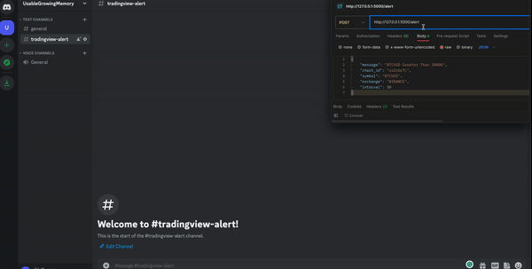

# TradingView Image Alert

A simple Flask application that allows you to receive webhook alerts from TradingView, capture a screenshot of the specified chart, and send the image along with the alert message to a Discord channel. This application utilizes Selenium to open a web browser window and capture the chart image as specified in the TradingView webhook request.



## Table of Contents

- [TradingView Image Alert](#tradingview-image-alert)
  - [Table of Contents](#table-of-contents)
  - [Installation](#installation)
  - [Configuration](#configuration)
  - [Usage](#usage)
  - [File Structure](#file-structure)
  - [Modifying the Application](#modifying-the-application)
  - [License](#license)

## Installation
To use this application, you'll need to have Python, Chrome and Chrome Webdriver installed on your server. Here are steps to install chrome and chrome webdriver on Ubuntu Server: https://tecadmin.net/setup-selenium-chromedriver-on-ubuntu/

Follow these steps to get started:

1. Clone this repository to your server.
    ```commandline
    git clone https://github.com/Karhal/tradingview-image-alert.git
    ```
   
2. Navigate to the cloned repository and install the required Python packages.
    ```commandline
    cd tradingview-image-alert
    pip install -r requirements.txt
    ```

## Configuration
Before you can use this application, you'll need to set the following environment variables:
1. `DISCORD_WEBHOOK_URL`: The Discord webhook URL to which the alert message and image will be sent. You can find instructions on how to create a webhook URL [here](https://support.discord.com/hc/en-us/articles/228383668-Intro-to-Webhooks).
2. `BASE_URL`: The base URL of the TradingView chart. For example, if the URL of your chart is `https://in.tradingview.com/chart/oz2zbrTL/`, then the base URL is `https://in.tradingview.com/`.
3. `IMAGE_DIR`: The directory where the chart images will be saved. Default value is `images`.

## Usage
To start the application, run the following command:
```commandline
python app.py
```
The above command will start the Flask development server. (Do not use this server in production. Use a production WSGI server such as Gunicorn instead.)

Once the server is running, you can send a webhook alert from TradingView to the `/alert` endpoint of the application. The alert message and chart image will be sent to the Discord channel specified in the `DISCORD_WEBHOOK_URL` environment variable.

Webhook URL: `http://<ip_or_domain>/alert`

The alert message set in TradingView should be in the following format:
```json
{
  "message": {
  "avatar_url":"https://cdn3.emoji.gg/emojis/7675-ethereum.png",
  "username": "{{ticker}}",
  "content": "🚀 {{ticker}} <Whatever your alert says>. Current price: {{close}}"
},
  "chart_id": "<chartId>>",
  "symbol": "{{ticker}}",
  "exchange": "{{exchange}}",
  "interval": "{{interval}}"
}
```
- `message`: The alert message that will be sent to the Discord channel.
- `chart_id`: The ID of the chart. This is the last part of the chart URL. For example, if the URL of your chart is `https://in.tradingview.com/chart/oz2zbrTL/`, then the chart ID is `oz2zbrTL`. Ensure that the chart is set to [sharing mode](https://www.tradingview.com/support/solutions/43000606515-how-to-share-charts-in-view-only-mode/).
- `symbol`: This key is optional. If specified, the chart will be opened with the specified symbol. If not specified, the chart will be opened with the default symbol set in the TradingView chart.
- `exchange`: This key is optional. If specified, the chart will be opened in the specified exchange. If not specified, the chart will be opened in the default exchange for the symbol.
- `interval`: This key is optional. If specified, the chart will be opened with the specified interval. If not specified, the chart will be opened with the default interval set in the TradingView chart.

## File Structure
```
tradingview-image-alert
├── app.py              # Flask application
├── README.md           # This file   
├── requirements.txt    # Requirements file
└── task_manager.py     # Task manager
```

## Modifying the Application
You can modify the application to suit your needs. Here are some ideas:
- Add support to Telegram, Teams, Slack, etc.
- Optionally click and modify the chart before taking the screenshot.
- Use a different browser or browser driver.
- Use celery or another task manager to run the screenshot task.

Contributions are welcome!

## License
This project is licensed under the MIT License. Feel free to use, modify, and distribute the code as per the terms of the license.